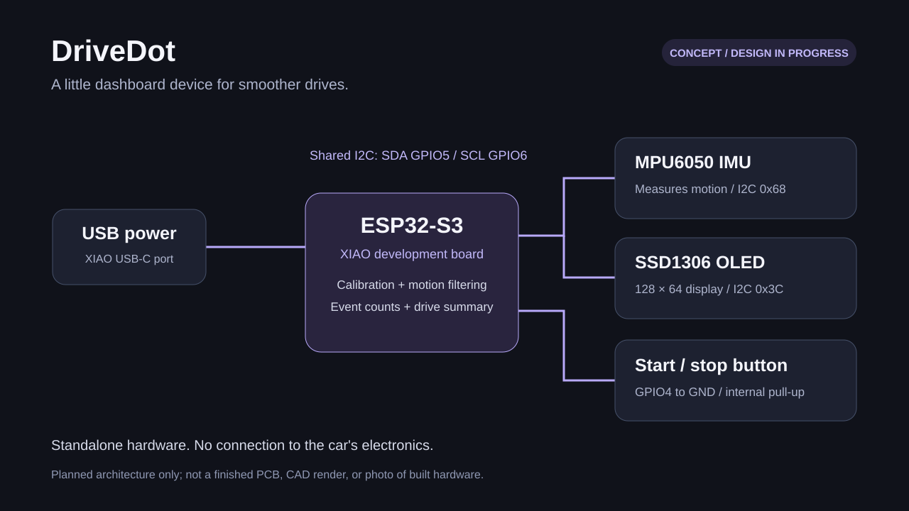

# DriveDot



*concept diagram — the pcb and enclosure are still to be designed.*

a little dashboard gadget that tells you how smooth your driving is.

drivedot is an ESP32-S3 with an IMU and a tiny OLED. it reads acceleration, braking, and cornering, draws a live g-force dot on the screen, and gives you a summary when the drive ends. runs off usb, doesn't touch the car's electronics at all.

i'm learning to drive, so i wanted my first hardware project to be something i'd actually use. it's my warm-up project for hack club half-life.

## where it's at

early. i used ai to scaffold the repo, so the structure and starter code came from that, and now i'm doing the real design and bench work. the motion/event logic has host tests and they pass. the firmware hasn't touched real hardware yet. no custom pcb, no enclosure, nothing road-tested, so no accuracy claims from me.

- **done:** concept, requirements, wiring plan
- **written, not tested on hardware:** esp32 firmware and oled ui
- **tested on my computer:** motion/event logic
- **sourced:** controller, imu, screen and button supplier listings; shipping, pcb and enclosure costs still need quotes
- **still to do:** pcb in KiCad, enclosure (once i've measured the actual modules), journal and demo evidence

## version 1

- Seeed Studio XIAO ESP32S3, GY-521 MPU6050 breakout, 128×64 SSD1306 OLED over I²C
- calibrate while parked before each session
- live forward/lateral acceleration with a g-force dot
- button to start/stop, then a summary with peak g and sustained-event counts
- csv over usb serial so i can sanity-check the numbers
- led feedback if the basics work and i have time

the score is a rough smoothness thing, not a safety grade. hills, bumps, sensor drift, and a shifted mounting angle all mess it up. check the summary while parked. the live feedback is really for a passenger during testing. mount it solid, out of your line of sight and away from airbags.

## running it

1. read the [build plan](docs/build-plan.md) and [wiring](hardware/wiring.md).
2. review the [selected parts](hardware/parts.md) and [BOM](hardware/bom.csv). check checkout totals before ordering; the $30 budget isn't confirmed yet.
3. open `firmware/` in VS Code with PlatformIO. the selected board is `seeed_xiao_esp32s3`.
4. build, upload through the XIAO's USB-C port using a data cable, and open the serial monitor:

```sh
   cd firmware
   pio run
   pio run --target upload
   pio device monitor
```

   other ESP32-S3 variants might need a different board config. see [firmware setup](docs/firmware.md).

5. keep the device still, send `c` to calibrate, then `n` to start a session and `e` to end it. once it's calibrated the button toggles a session too.
6. i'm logging what i actually do in the [journal](journal/README.md), with screenshots and real time spent.

to run the motion tests without a microcontroller:

```sh
python3 scripts/test.py
```

## what's where

- `firmware/`: platformio project, oled/imu code, motion logic and its tests
- `hardware/`: wiring, bom, pcb and enclosure briefs
- `docs/`: build plan, firmware notes, validation, references
- `journal/`: work log (empty until i actually do the work)
- `.github/workflows/`: automated host tests and firmware build

## next design session

open [the schematic walkthrough](docs/first-schematic.md). it gives you the connections to draw in KiCad and what to check before making a PCB.

## half-life

still need to finish the real schematic, pcb, and cad files, lock down the bom, and show proof of my own design work.

## license

MIT. see [LICENSE](LICENSE).
