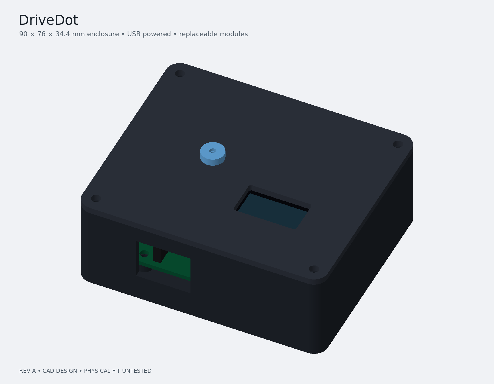
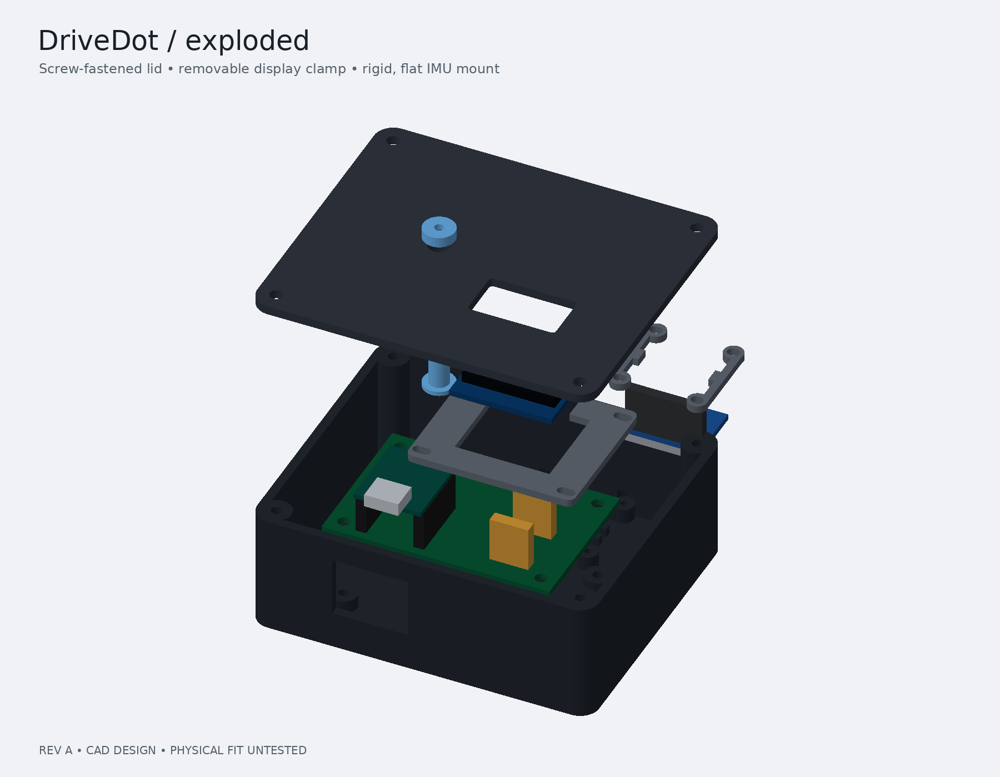

# DriveDot



*revision a CAD render — this hasn't been printed or built yet.*

a little dashboard gadget that tells you how smooth your driving is.

drivedot is an ESP32-S3 with an IMU and a tiny OLED. it reads acceleration, braking, and cornering, draws a live g-force dot on the screen, and gives you a summary when the drive ends. runs off usb, doesn't touch the car's electronics at all.

i'm learning to drive, so i wanted my first hardware project to be something i'd actually use. it's my warm-up project for hack club half-life.

## where it's at

revision a has an actual schematic, routed carrier pcb, printable case and firmware. i used ai to help create these files. the source, exports and checks are here so i can review them, make changes and build the prototype.

- **designed:** 60 × 40 mm, two-layer carrier pcb with XIAO sockets, screen/sensor headers and a button
- **modeled:** screw-fastened case, screen clamp, flat sensor cradle and button plunger
- **implemented:** standalone button controls, calibration, live display, session summary and usb csv
- **checked:** schematic/pcb rules and portable motion, button and calibration tests; see [validation](docs/validation.md)
- **still to do:** measure the real modules, confirm the full cost, print, solder, bench-test and record the results

no physical fit test or road test yet, so no accuracy claims from me. the four main supplier listings total $13.24, but that leaves out fabrication, connectors, printing, fasteners, shipping and tax. **the complete $30 budget isn't confirmed.**

## open the design

| what | files |
| --- | --- |
| schematic, routed board and fabrication exports | [KiCad project](hardware/pcb/README.md) |
| printable parts, editable CAD, STEP and renders | [enclosure](hardware/enclosure/README.md) |
| parts and required quantities | [selected parts](hardware/parts.md) · [planning BOM](hardware/bom.csv) |
| putting it together | [assembly guide](docs/assembly.md) · [wiring](hardware/wiring.md) |
| firmware and controls | [firmware setup](docs/firmware.md) |
| what's checked and what still needs testing | [validation](docs/validation.md) · [build plan](docs/build-plan.md) |



*exploded CAD view. the screen and sensor connect with short wires; their modeled envelopes still need checking against the received parts.*

## version 1

- Seeed Studio XIAO ESP32S3, GY-521 MPU6050 and 128 × 64 SSD1306 OLED
- hold the button for 1.5 seconds, then release to calibrate while parked and still
- short press/release to start or end a session
- live forward/lateral acceleration and a g-force dot
- summary with peak g and sustained-event counts
- csv over usb serial for checking the numbers

the score is a rough smoothness thing, not a safety grade. hills, bumps, sensor drift, and a shifted mounting angle all mess it up. check the summary while parked. the live feedback is really for a passenger during testing. mount it solid, flat, out of your line of sight and away from airbags.

## running it

1. read the [assembly guide](docs/assembly.md), [schematic notes](docs/first-schematic.md) and [wiring](hardware/wiring.md).
2. open `firmware/` in VS Code with PlatformIO. the selected board is `seeed_xiao_esp32s3`.
3. build and upload through the XIAO's USB-C port with a data cable:

```sh
cd firmware
pio run
pio run --target upload
pio device monitor
```

4. mount the sensor flat and keep it still. hold the button for 1.5 seconds and release when prompted. after calibration, tap to start and tap again to end.
5. serial commands also work: `c` calibrates, `n` starts and `e` ends. see [firmware setup](docs/firmware.md) for errors and limitations.

to run the logic tests without a microcontroller:

```sh
python3 scripts/test.py
```

## half-life

[journal entries](JOURNAL.md) and the event's [parts list](BOM.md) are synced by half-life. i'll record my actual work, measurements, photos and time there. the generated design files and renders aren't evidence of a physical build or hours spent by me. event eligibility and submission requirements still need checking.

## license

MIT. see [LICENSE](LICENSE).
