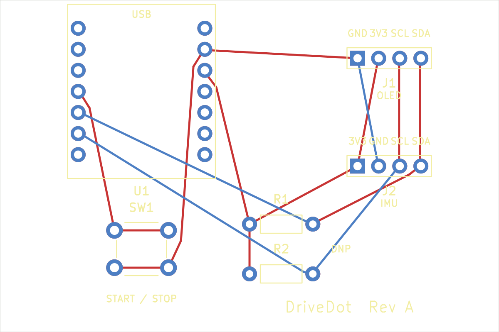

# DriveDot carrier — revision A

This is an actual two-layer KiCad design with a routed PCB, schematic, Gerbers and drill files. It is **an unbuilt prototype design**. Electrical and design-rule checks pass; received-part fit, assembly, power-up and driving measurements have not been tested.



## Open the design

Open [`drivedot.kicad_pro`](drivedot.kicad_pro) in **KiCad 9**. The project-local symbols, footprints and library tables are included. There are no library downloads needed to edit this board.

- [Schematic PDF](exports/drivedot-schematic.pdf) · [schematic image](exports/drivedot-schematic.png)
- [Front copper preview](exports/drivedot-front.png) · [back copper preview, mirrored](exports/drivedot-back.png)
- [Schematic source](drivedot.kicad_sch) · [PCB source](drivedot.kicad_pcb)
- [Fabrication exports](fabrication/) · [fabrication ZIP](drivedot-rev-a-gerbers.zip)
- [ERC report](validation/erc.rpt) · [DRC and schematic-parity report](validation/drc.rpt)
- [Footprint evidence and license](SOURCES.md)

## Circuit and assembly

U1 holds the **standard Seeed XIAO ESP32S3**, USB facing the `USB` silkscreen. Solder two 1×7, 2.54 mm male headers to the XIAO and matching female sockets to the carrier. The 15.24 mm spacing between socket rows follows Seeed's official footprint. Socket mounting avoids pressing the XIAO's underside components against this carrier.

The display and GY-521 are mounted separately in the enclosure and joined with short insulated wires. J1 and J2 are **different power orders**. Their pin 1 pads are square. Viewed from the component side, pins increase left to right:

| Carrier pin | J1 → OLED | J2 → GY-521 |
| --- | --- | --- |
| 1 | GND | VCC / 3.3 V |
| 2 | VCC / 3.3 V | GND |
| 3 | SCL | SCL |
| 4 | SDA | SDA |

Connect the other end by the module's printed labels, including when a supplied header orientation differs. U1 D4/GPIO5 supplies SDA, D5/GPIO6 supplies SCL, and D3/GPIO4 reads SW1. Leave the sensor's AD0 low for address `0x68`; the OLED is expected at `0x3C`. The 5 V XIAO header pad is intentionally unconnected.

SW1 is a 6 mm tactile switch with 6.5 × 4.5 mm lead spacing. The two pads along each horizontal row are the same switch terminal. Confirm this with a continuity meter before soldering an alternate switch. Its actuator height must match the enclosure's adjustable button stem.

**R1 and R2 are optional 4.7 kΩ pull-ups and default to DNP (do not populate).** The footprints use 7.62 mm axial lead pitch. Selected modules may already contain pull-ups; adding another pair blindly changes the bus loading. Neither resistor is needed in the default carrier purchase list until the actual modules are inspected.

### Power-up checks

1. Unplug USB. Check socket orientation, continuity, absence of a 3.3 V-to-ground short, and all four harness wires against their labels.
2. Power the XIAO alone first, then connect the modules with USB unplugged. Power comes only from the XIAO USB-C port.
3. Measure the carrier 3.3 V rail and the GY-521's actual regulated sensor rail. The supplier lists 3.3 V VCC operation, but generic GY-521 regulator revisions vary. A dropout-prone module can undervolt the sensor; verify its rail against the actual regulator and MPU6050 specifications.
4. Check idle SDA/SCL voltages and the modules' pull-up supply rails. All bus signals must be compatible with the XIAO's 3.3 V logic. If the breakout revision is incompatible, change the module or design before using it; do not move J2 to 5 V by improvising a wire.
5. Run an I2C scanner, verify `0x68` and `0x3C`, then verify sensor axis directions and the button before closing the case.

Mount the IMU flat and rigidly: X forward, Y left, Z up. Calibration and vehicle motion testing still need to be done. This carrier has no connection to vehicle control or wiring.

## Mechanical interface

Coordinates are millimetres, viewed from above, origin at the carrier's USB-side left corner. Positive X runs right; positive Y runs away from the USB edge.

| Feature | Position / dimensions |
| --- | --- |
| Carrier | 60 × 40 × 1.6 mm |
| Non-plated mounting holes | Ø3.2 mm at (4,4), (56,4), (56,36), (4,36) |
| XIAO centre | (17,11), USB toward negative Y |
| XIAO board envelope | X 8.1–25.9; Y 0.5–21.5 mm |
| XIAO pin rows | X 9.38 / 24.62; first row Y 3.38; 2.54 mm pitch |
| J1 OLED | Pin 1 at (43,7); four pads along +X, 2.54 mm pitch |
| J2 IMU | Pin 1 at (43,20); four pads along +X, 2.54 mm pitch |
| SW1 actuator centre | (17,30) |
| R1 / R2 | Pin 1 at (30,27) / (30,33), 7.62 mm pitch along +X |

Allow up to **16 mm above the carrier** for an ordinary socket, male header, XIAO board and USB connector stack. This is a clearance allowance, not a measured supplied-part height. Check the actual header stack and cable moulding before printing a final enclosure. The USB shell extends approximately 1 mm beyond the carrier's Y=0 edge. The XIAO uses an external U.FL antenna connector; this firmware does not enable radio functions. There is no fictional on-board antenna keepout. If radio functionality is added, the external antenna must be placed and verified separately.

## Fabrication and validation

Suggested prototype fabrication settings: **two-layer FR-4, 1.6 mm, 1 oz copper**, ordinary solder mask, plated component holes and separate non-plated mounting holes. Board dimensions and hole type must be checked in the fabricator's viewer before ordering. The ZIP contains manufacturing files; it is not evidence of assembly or electrical operation.

KiCad **9.0.9** reports **0 ERC violations, 0 DRC violations, 0 unconnected items and 0 schematic-parity issues**, with warnings and exclusions included. No ERC or DRC issues are excluded. The four mechanical holes are intentionally board-only footprints. Tracks are 0.25 mm with a 0.20 mm minimum clearance. There are 30 plated component holes and 4 non-plated mounting holes; this layout needs no vias.

The generator and exports are reproducible:

```bash
/usr/bin/python3 scripts/generate_pcb.py
bash scripts/generate_pcb_exports.sh
```

Run from the repository root with KiCad 9's Python `pcbnew` module and CLI installed. The generator rebuilds sources and can overwrite manual CAD edits. Editing the committed KiCad files directly is also supported; rerun the export script after editing. It removes the previous fabrication ZIP before checking the design, and recreates the ZIP and validation hashes only after checks pass. Install the optional `cairosvg` Python package to refresh PNG previews in the same command; native SVG/PDF exports do not need it. PNG previews are rasterizations of the native SVG exports, not concept artwork. The supplied component and net names are checked against an exported schematic netlist before routing, and KiCad independently checks schematic/PCB parity afterward.
